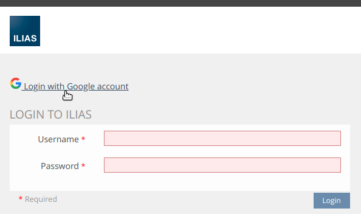

# SrGoogleAccountAuth ILIAS Plugin Description

We have created an UI hook plugin because auth plugins currently not working properly

## Google web client config
TODO: Link to create google web client

You need to authenticate the follow redirect url
```
https://your-domain/login.php?target=uihk_srgoogacauth
```

For the plugin config you need the client id and the client secret

Login screen:

